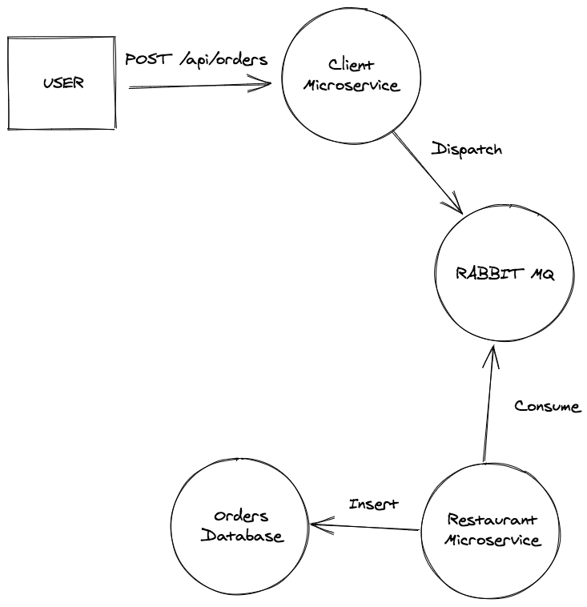

# Getting started 🚀

` docker-compose up --build -d`

Change your host file 

```
127.0.0.1 restaurant.local
127.0.0.1 client.local
```

## Setup Client

`docker-compose exec php-client sh`

`composer install`

`./bin/console lexik:jwt:generate-keypair`

`./bin/console doctrine:schema:update --force`

`./bin/console doctrine:fixtures:load`

## Setup Restaurant

`docker-compose exec php-restaurant sh`

`composer install`

`./bin/console doctrine:schema:update --force`

`./bin/console doctrine:fixtures:load`

## PUBLIC API

`POST http://client.local/api/login_check`

Payload : 

```json
{
    "username" : "test@test.com",
    "password" : "test"
}
```
`POST http://client.local/api/register`

Payload : 

```json
{
    "username" : "test1@test.com",
    "password" : "test"
}
```
## AUTHENTICATED API


⚠ don't forget to set Authorization in request header like so :

`Authorization: Bearer {token}`

___

`POST http://client.local/api/orders`

Payload : 

```json
{
    "restaurant" : "1",
    "products": ["quiche", "salade"]
}
```
`GET http://client.local/api/restaurants`

`GET http://client.local/api/restaurants/1`

# How order system works exactly


